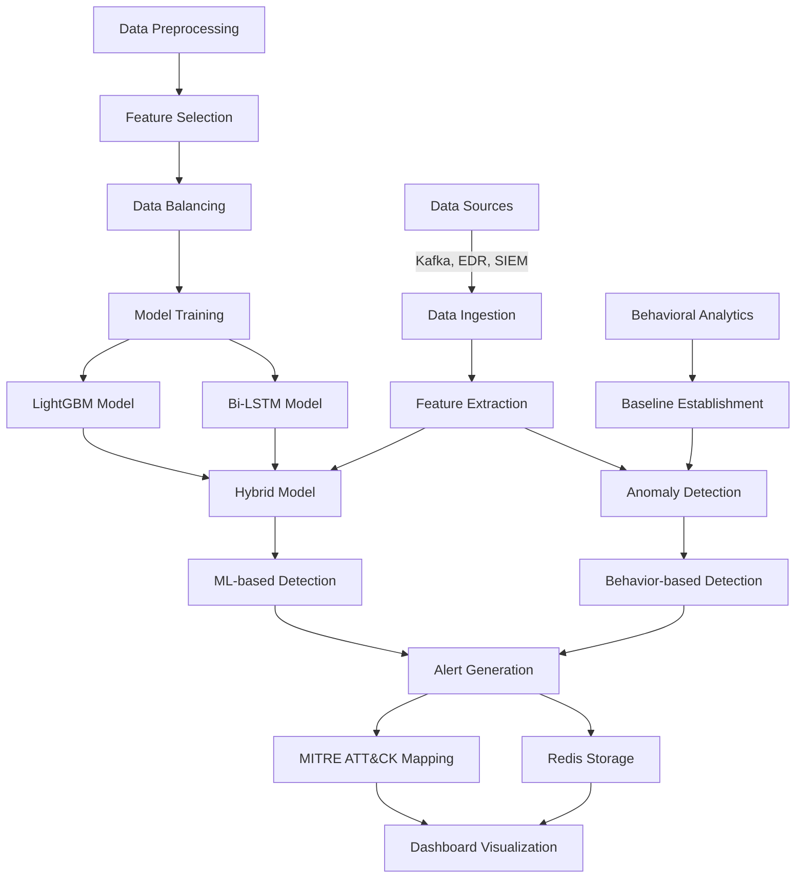

# APT Detection System Architecture

This document provides a comprehensive overview of the APT Detection System architecture, explaining how components interact, the data flow through the system, and the reasoning behind key design decisions.

## System Overview

The APT Detection System is designed as a modular, multi-layered security solution that combines machine learning, behavioral analytics, and real-time monitoring to detect advanced persistent threats. The architecture follows a microservices-inspired approach where components can operate independently but work together to provide comprehensive threat detection.

## Core Components

### 1. Data Ingestion Layer

The Data Ingestion layer is responsible for collecting data from multiple sources and normalizing it for processing.

#### Components:
- **Kafka Consumer**: Processes messages from Kafka streams
- **Connector Manager**: Manages connections to external data sources
- **Data Normalization**: Converts data from different sources into a standard format

#### Design Decisions:
- **Why Kafka is Optional**: The system is designed to work with multiple data sources. Kafka provides high-throughput, real-time data streaming but is not required if you're using other data sources like Wazuh or Elasticsearch. The system will automatically skip Kafka initialization if it's not configured and continue to function with other data sources.
- **Connector Architecture**: The connector system uses a plugin-based architecture that allows for easy addition of new data sources without modifying the core code.

### 2. Machine Learning Layer

The Machine Learning layer is responsible for analyzing data and detecting potential threats.

#### Components:
- **Feature Selection**: Uses HHOSSSA algorithm to select relevant features
- **Data Balancing**: Applies HHOSSSA-SMOTE to address class imbalance
- **Model Training**: Trains LightGBM and Bi-LSTM models
- **Hybrid Model**: Combines predictions from multiple models

#### Design Decisions:
- **Hybrid Model Approach**: We use a hybrid model that combines the strengths of different algorithms:
  - LightGBM: Efficient for tabular data with good interpretability
  - Bi-LSTM: Excellent for sequence data and temporal patterns
  - The hybrid approach provides better accuracy than either model alone

### 3. Behavioral Analytics Layer

The Behavioral Analytics layer establishes baselines of normal behavior and detects anomalies.

#### Components:
- **Baseline Establishment**: Creates profiles of normal behavior for entities
- **Anomaly Detection**: Identifies deviations from established baselines
- **Feature Analysis**: Determines which features contributed to anomalies

#### Design Decisions:
- **Entity-Based Analysis**: The system analyzes behavior at the entity level (hosts, users, etc.) rather than globally, allowing for more precise detection of anomalies specific to each entity.
- **Temporal Analysis**: Behavioral patterns are analyzed over time to detect gradual changes that might indicate an APT.

### 4. Alert Generation Layer

The Alert Generation layer creates alerts based on detection results and maps them to the MITRE ATT&CK framework.

#### Components:
- **Alert Creation**: Generates alerts with severity, entity, and feature information
- **MITRE ATT&CK Mapping**: Maps threats to MITRE techniques and tactics
- **Alert Storage**: Stores alerts in Redis for persistence and sharing

#### Design Decisions:
- **Redis Integration**: We chose Redis for alert storage because:
  - It provides persistence across system restarts
  - It enables sharing data between different processes
  - It's fast and efficient for real-time operations
  - It has built-in data structures that match our needs
- **Fallback Mechanism**: If Redis is unavailable, the system falls back to in-memory storage to ensure continued operation.

### 5. Dashboard Layer

The Dashboard layer provides visualization and analysis tools for security analysts.

#### Components:
- **Overview**: Alert statistics, timeline, and top entities
- **Alerts**: Detailed alert information with filtering
- **Entity Analysis**: Entity behavior statistics and anomaly detection
- **Models**: Status of machine learning models and behavioral baselines
- **Connectors**: Status and configuration of data source connectors

#### Design Decisions:
- **Flask Framework**: We chose Flask for the dashboard because it's lightweight, flexible, and easy to integrate with the Python-based backend.
- **Real-time Updates**: The dashboard retrieves data from Redis to provide real-time updates on alerts and system status.

## Data Flow

1. **Data Collection**:
   - Data is collected from multiple sources (Kafka, EDR, SIEM)
   - The Connector Manager handles connections to external systems
   - Data is normalized into a standard format

2. **Feature Extraction**:
   - Features are extracted from the normalized data
   - Features include network traffic, login attempts, file access, etc.

3. **Threat Detection**:
   - The Hybrid Model analyzes features to detect known threat patterns
   - The Behavioral Analytics module detects anomalies based on established baselines

4. **Alert Generation**:
   - Alerts are generated for detected threats and anomalies
   - Alerts include severity, entity, features, and MITRE ATT&CK mapping
   - Alerts are stored in Redis for persistence and sharing

5. **Visualization**:
   - The Dashboard retrieves alerts from Redis
   - Alerts are visualized in various formats (timelines, charts, tables)
   - Security analysts can filter and analyze alerts

## Deployment Considerations

### Scaling

The system is designed to scale horizontally:

- **Kafka**: Can be scaled by adding more brokers and partitions
- **Redis**: Can be configured for high availability with Redis Sentinel or Redis Cluster
- **Connectors**: Can be deployed on separate machines to distribute load
- **Processing**: The data ingestion and processing components can be distributed across multiple machines

### Security

The system includes several security features:

- **Authentication**: Secure authentication for all data source connections
- **Data Encryption**: Encryption of sensitive configuration data
- **Input Validation**: Validation of all input data to prevent injection attacks
- **Secure Defaults**: Secure default configurations for all components

### Performance

Performance considerations include:

- **Batch Processing**: The system can process data in batches to improve throughput
- **Caching**: Redis is used for caching to improve performance
- **Asynchronous Processing**: Non-critical tasks are processed asynchronously
- **Resource Management**: The system monitors and manages resource usage to prevent overload

## Component Dependencies

Understanding component dependencies is crucial for maintenance and troubleshooting:

- **Kafka** (Optional): Required only if using Kafka as a data source
- **Redis** (Recommended): Required for alert storage and sharing between processes
- **Wazuh/Elasticsearch** (Optional): Required only if using these as data sources
- **Python Libraries**: Listed in requirements.txt

## Configuration

The system is configured through the `config.yaml` file, which includes sections for:

- **Model Configuration**: Paths to model files and training parameters
- **Data Source Configuration**: Connection details for Kafka, Wazuh, Elasticsearch
- **Behavioral Analytics Configuration**: Parameters for baseline establishment and anomaly detection
- **Dashboard Configuration**: Settings for the web dashboard

## Conclusion

The APT Detection System architecture is designed to be flexible, scalable, and robust. By combining multiple detection techniques and data sources, it provides comprehensive protection against advanced persistent threats. The modular design allows for easy extension and customization to meet specific security requirements.
