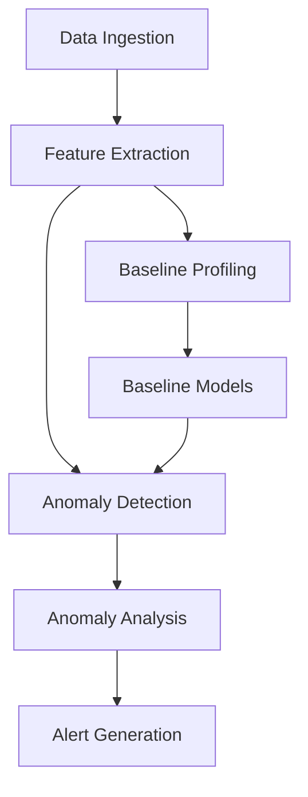

# Behavioral Analytics in the APT Detection System

This document provides detailed information about the behavioral analytics component of the APT Detection System, including how it establishes baselines, detects anomalies, and analyzes entity behavior.

## Overview

The behavioral analytics component is a critical part of the APT Detection System that focuses on detecting anomalous behavior that may indicate an advanced persistent threat. Unlike traditional signature-based detection, behavioral analytics establishes baselines of normal behavior for entities (hosts, users, etc.) and identifies deviations from these baselines.

## Key Concepts

### Entity-Based Analysis

The system analyzes behavior at the entity level rather than globally. This approach allows for more precise detection of anomalies specific to each entity, as what is normal for one entity may be anomalous for another.

### Temporal Analysis

Behavioral patterns are analyzed over time to detect gradual changes that might indicate an APT. This temporal analysis is crucial for identifying slow-moving threats that might evade traditional detection methods.

### Feature-Based Profiling

The system creates profiles based on multiple features, such as network traffic, login attempts, file access, etc. This multi-dimensional approach provides a more comprehensive view of entity behavior.

### Adaptive Baselines

Baselines are not static but adapt over time to account for legitimate changes in behavior. This adaptability reduces false positives while maintaining detection capabilities.

## Architecture

The behavioral analytics component consists of several subcomponents:



### Components

1. **Feature Extraction**: Extracts relevant features from raw data
2. **Baseline Profiling**: Establishes baselines of normal behavior
3. **Baseline Models**: Stores and manages baseline models
4. **Anomaly Detection**: Identifies deviations from baselines
5. **Anomaly Analysis**: Analyzes detected anomalies
6. **Alert Generation**: Generates alerts for significant anomalies

## Implementation

The behavioral analytics component is implemented in `real_time_detection/behavioral_analytics.py`. The key classes and methods are:

### BehavioralAnalytics Class

```python
class BehavioralAnalytics:
    """
    Behavioral Analytics for APT detection.
    
    This class provides methods for establishing baselines of normal behavior
    and detecting anomalies that may indicate an APT.
    """
    
    def __init__(self, config_path=None):
        """
        Initialize the behavioral analytics component.
        
        Args:
            config_path: Path to the configuration file
        """
        self.logger = logging.getLogger(__name__)
        self.config = {}
        self.baseline_models = {}
        self.anomaly_threshold = 0.8
        self.time_window_minutes = 10
        
        # Load configuration
        if config_path:
            self.load_config(config_path)
    
    def load_config(self, config_path):
        """
        Load configuration from a YAML file.
        
        Args:
            config_path: Path to the configuration file
        """
        try:
            with open(config_path, 'r') as file:
                self.config = yaml.safe_load(file)
                
                # Get behavioral analytics settings
                ba_settings = self.config.get('settings', {}).get('behavioral_analytics', {})
                self.anomaly_threshold = ba_settings.get('anomaly_threshold', 0.8)
                self.time_window_minutes = ba_settings.get('time_window_minutes', 10)
                
                self.logger.info(f"Loaded behavioral analytics configuration from {config_path}")
                self.logger.info(f"Anomaly threshold: {self.anomaly_threshold}")
                self.logger.info(f"Time window: {self.time_window_minutes} minutes")
        except Exception as e:
            self.logger.error(f"Error loading configuration: {str(e)}")
    
    def establish_baseline(self, data=None, days=7):
        """
        Establish baselines of normal behavior.
        
        Args:
            data: Historical data for baseline establishment
            days: Number of days of historical data to use
        """
        self.logger.info(f"Establishing baselines using {days} days of historical data")
        
        # If no data provided, load historical data
        if data is None:
            data = self._load_historical_data(days)
        
        if data.empty:
            self.logger.warning("No data available for baseline establishment")
            return
        
        # Group data by entity
        entities = data['entity'].unique()
        self.logger.info(f"Establishing baselines for {len(entities)} entities")
        
        for entity in entities:
            entity_data = data[data['entity'] == entity]
            
            # Create baseline model for entity
            self.baseline_models[entity] = self._create_baseline_model(entity_data)
            
            self.logger.info(f"Established baseline for entity: {entity}")
    
    def _create_baseline_model(self, entity_data):
        """
        Create a baseline model for an entity.
        
        Args:
            entity_data: Data for the entity
            
        Returns:
            Baseline model
        """
        # Extract features
        features = self._extract_baseline_features(entity_data)
        
        # Create isolation forest model
        model = IsolationForest(
            n_estimators=100,
            max_samples='auto',
            contamination='auto',
            random_state=42
        )
        
        # Fit model
        model.fit(features)
        
        # Calculate feature statistics
        feature_stats = {}
        for column in features.columns:
            feature_stats[column] = {
                'mean': features[column].mean(),
                'std': features[column].std(),
                'min': features[column].min(),
                'max': features[column].max(),
                'q1': features[column].quantile(0.25),
                'median': features[column].quantile(0.5),
                'q3': features[column].quantile(0.75)
            }
        
        # Return baseline model
        return {
            'model': model,
            'feature_stats': feature_stats,
            'last_updated': datetime.now().isoformat()
        }
    
    def _extract_baseline_features(self, entity_data):
        """
        Extract features for baseline establishment.
        
        Args:
            entity_data: Data for the entity
            
        Returns:
            Features for baseline establishment
        """
        # Select relevant columns
        feature_columns = [
            'network_traffic_volume_mean',
            'number_of_logins_mean',
            'number_of_failed_logins_mean',
            'number_of_accessed_files_mean',
            'number_of_email_sent_mean',
            'cpu_usage_mean',
            'memory_usage_mean',
            'disk_io_mean',
            'network_latency_mean',
            'number_of_processes_mean'
        ]
        
        # Select features
        features = entity_data[feature_columns].copy()
        
        # Handle missing values
        features.fillna(0, inplace=True)
        
        return features
    
    def detect_anomalies(self, data):
        """
        Detect anomalies in entity behavior.
        
        Args:
            data: Data to analyze for anomalies
            
        Returns:
            List of detected anomalies
        """
        if data.empty:
            return []
        
        anomalies = []
        
        # Group data by entity
        entities = data['entity'].unique()
        
        for entity in entities:
            entity_data = data[data['entity'] == entity]
            
            # Get baseline model for entity
            baseline_model = self.baseline_models.get(entity)
            
            # If no baseline model exists, create one
            if baseline_model is None:
                self.logger.info(f"No baseline model found for entity: {entity}. Creating one.")
                baseline_model = self._create_baseline_model(entity_data)
                self.baseline_models[entity] = baseline_model
            
            # Detect anomalies for entity
            entity_anomalies = self._detect_entity_anomalies(entity, entity_data, baseline_model)
            anomalies.extend(entity_anomalies)
        
        return anomalies
    
    def _detect_entity_anomalies(self, entity, entity_data, baseline_model):
        """
        Detect anomalies for a specific entity.
        
        Args:
            entity: Entity to analyze
            entity_data: Data for the entity
            baseline_model: Baseline model for the entity
            
        Returns:
            List of detected anomalies
        """
        # Extract features
        features = self._extract_baseline_features(entity_data)
        
        # Get model
        model = baseline_model['model']
        
        # Predict anomaly scores
        anomaly_scores = -model.decision_function(features)
        
        # Normalize scores to [0, 1]
        min_score = anomaly_scores.min()
        max_score = anomaly_scores.max()
        if max_score > min_score:
            normalized_scores = (anomaly_scores - min_score) / (max_score - min_score)
        else:
            normalized_scores = np.zeros_like(anomaly_scores)
        
        # Detect anomalies
        anomalies = []
        for i, score in enumerate(normalized_scores):
            if score >= self.anomaly_threshold:
                # Get data point
                data_point = entity_data.iloc[i]
                
                # Analyze anomalous features
                anomalous_features = self._analyze_anomalous_features(
                    features.iloc[i],
                    baseline_model['feature_stats']
                )
                
                # Create anomaly
                anomaly = {
                    'entity': entity,
                    'timestamp': data_point.get('timestamp', datetime.now().isoformat()),
                    'anomaly_score': float(score),
                    'severity': self._determine_severity(score),
                    'features': anomalous_features
                }
                
                anomalies.append(anomaly)
                
                self.logger.info(f"Detected anomaly for entity: {entity}, score: {score:.4f}")
        
        return anomalies
    
    def _analyze_anomalous_features(self, features, feature_stats):
        """
        Analyze which features contributed to the anomaly.
        
        Args:
            features: Features of the data point
            feature_stats: Feature statistics from the baseline
            
        Returns:
            Dictionary of anomalous features with their values and z-scores
        """
        anomalous_features = {}
        
        for feature, value in features.items():
            # Calculate z-score
            mean = feature_stats[feature]['mean']
            std = feature_stats[feature]['std']
            
            # Avoid division by zero
            if std > 0:
                z_score = (value - mean) / std
            else:
                z_score = 0
            
            # Check if feature is anomalous
            if abs(z_score) >= 2:  # More than 2 standard deviations from the mean
                anomalous_features[feature] = {
                    'value': float(value),
                    'z_score': float(z_score),
                    'mean': float(mean),
                    'std': float(std)
                }
        
        return anomalous_features
    
    def _determine_severity(self, anomaly_score):
        """
        Determine the severity of an anomaly based on its score.
        
        Args:
            anomaly_score: Anomaly score
            
        Returns:
            Severity level (Critical, High, Medium, Low)
        """
        if anomaly_score >= 0.95:
            return 'Critical'
        elif anomaly_score >= 0.9:
            return 'High'
        elif anomaly_score >= 0.8:
            return 'Medium'
        else:
            return 'Low'
    
    def update_baselines(self, data):
        """
        Update baselines with new data.
        
        Args:
            data: New data for baseline update
        """
        if data.empty:
            return
        
        # Group data by entity
        entities = data['entity'].unique()
        
        for entity in entities:
            entity_data = data[data['entity'] == entity]
            
            # Get baseline model for entity
            baseline_model = self.baseline_models.get(entity)
            
            # If no baseline model exists, create one
            if baseline_model is None:
                self.logger.info(f"No baseline model found for entity: {entity}. Creating one.")
                baseline_model = self._create_baseline_model(entity_data)
                self.baseline_models[entity] = baseline_model
                continue
            
            # Update baseline model
            self._update_baseline_model(entity, entity_data, baseline_model)
    
    def _update_baseline_model(self, entity, entity_data, baseline_model):
        """
        Update a baseline model for an entity.
        
        Args:
            entity: Entity to update
            entity_data: New data for the entity
            baseline_model: Existing baseline model
        """
        # Extract features
        features = self._extract_baseline_features(entity_data)
        
        # Get model
        model = baseline_model['model']
        
        # Partial fit model (if supported)
        if hasattr(model, 'partial_fit'):
            model.partial_fit(features)
        else:
            # If partial_fit is not supported, create a new model
            new_model = self._create_baseline_model(entity_data)
            baseline_model['model'] = new_model['model']
            baseline_model['feature_stats'] = new_model['feature_stats']
        
        # Update last updated timestamp
        baseline_model['last_updated'] = datetime.now().isoformat()
        
        self.logger.info(f"Updated baseline for entity: {entity}")
    
    def _load_historical_data(self, days):
        """
        Load historical data for baseline establishment.
        
        Args:
            days: Number of days of historical data to load
            
        Returns:
            Historical data
        """
        # This is a placeholder. In a real implementation, this would load data from a database or file.
        self.logger.info(f"Loading {days} days of historical data")
        
        # Return empty DataFrame for now
        return pd.DataFrame()
```

## Baseline Establishment

The baseline establishment process involves several steps:

1. **Data Collection**: Historical data is collected for each entity
2. **Feature Extraction**: Relevant features are extracted from the data
3. **Statistical Analysis**: Statistical properties of features are calculated
4. **Model Creation**: An Isolation Forest model is created for each entity
5. **Baseline Storage**: Baselines are stored for future reference

### Configuration

The baseline establishment process can be configured in `config.yaml`:

```yaml
settings:
  behavioral_analytics:
    baseline_period_days: 7
    anomaly_threshold: 0.8
    time_window_minutes: 10
```

### Usage

```python
from real_time_detection.behavioral_analytics import BehavioralAnalytics

# Create behavioral analytics component
ba = BehavioralAnalytics(config_path='config.yaml')

# Establish baselines
ba.establish_baseline(days=7)
```

## Anomaly Detection

The anomaly detection process involves several steps:

1. **Feature Extraction**: Features are extracted from new data
2. **Anomaly Scoring**: Anomaly scores are calculated using the baseline models
3. **Threshold Comparison**: Scores are compared to the anomaly threshold
4. **Feature Analysis**: Anomalous features are identified and analyzed
5. **Severity Determination**: Severity levels are assigned to anomalies
6. **Alert Generation**: Alerts are generated for significant anomalies

### Anomaly Scoring

The system uses Isolation Forest for anomaly scoring. Isolation Forest is an unsupervised learning algorithm that isolates anomalies by randomly selecting a feature and then randomly selecting a split value between the maximum and minimum values of the selected feature.

The anomaly score is calculated as:
- A score close to 1 indicates an anomaly
- A score close to 0 indicates normal behavior

### Feature Analysis

When an anomaly is detected, the system analyzes which features contributed to the anomaly by calculating z-scores for each feature:

```
z-score = (value - mean) / standard_deviation
```

Features with z-scores greater than 2 (more than 2 standard deviations from the mean) are considered anomalous.

### Severity Determination

The severity of an anomaly is determined based on its anomaly score:

- **Critical**: Score >= 0.95
- **High**: Score >= 0.9
- **Medium**: Score >= 0.8
- **Low**: Score < 0.8

### Usage

```python
from real_time_detection.behavioral_analytics import BehavioralAnalytics

# Create behavioral analytics component
ba = BehavioralAnalytics(config_path='config.yaml')

# Detect anomalies
anomalies = ba.detect_anomalies(data)

# Process anomalies
for anomaly in anomalies:
    print(f"Entity: {anomaly['entity']}")
    print(f"Timestamp: {anomaly['timestamp']}")
    print(f"Anomaly Score: {anomaly['anomaly_score']}")
    print(f"Severity: {anomaly['severity']}")
    print("Anomalous Features:")
    for feature, details in anomaly['features'].items():
        print(f"  {feature}: value={details['value']}, z-score={details['z_score']}")
```

## Baseline Adaptation

The baseline adaptation process involves several steps:

1. **Data Collection**: New data is collected for each entity
2. **Feature Extraction**: Relevant features are extracted from the data
3. **Model Update**: Baseline models are updated with the new data
4. **Statistical Update**: Statistical properties are updated

### Adaptation Strategies

The system supports several adaptation strategies:

1. **Partial Fit**: If the model supports partial_fit, it is used to update the model incrementally
2. **Retraining**: If partial_fit is not supported, a new model is created with the new data
3. **Weighted Update**: Statistical properties are updated with a weighted average of old and new values

### Usage

```python
from real_time_detection.behavioral_analytics import BehavioralAnalytics

# Create behavioral analytics component
ba = BehavioralAnalytics(config_path='config.yaml')

# Update baselines
ba.update_baselines(data)
```

## Integration with Other Components

The behavioral analytics component integrates with other components of the APT Detection System:

1. **Data Ingestion**: Provides data for baseline establishment and anomaly detection
2. **Prediction Engine**: Combines anomaly detection results with ML-based detection
3. **Alert Generation**: Generates alerts for detected anomalies
4. **Dashboard**: Visualizes entity behavior and anomalies

## Use Cases

### 1. Insider Threat Detection

The behavioral analytics component can detect insider threats by identifying unusual behavior patterns of users, such as:

- Accessing sensitive files outside normal working hours
- Downloading unusually large amounts of data
- Logging in from unusual locations
- Executing unusual commands

### 2. Lateral Movement Detection

The component can detect lateral movement by identifying unusual network connections between entities, such as:

- Connections to systems that are not normally accessed
- Unusual patterns of authentication
- Unusual file access patterns
- Unusual command execution

### 3. Data Exfiltration Detection

The component can detect data exfiltration by identifying unusual data transfer patterns, such as:

- Unusually large data transfers
- Transfers to unusual destinations
- Transfers at unusual times
- Unusual protocols or channels

### 4. Privilege Escalation Detection

The component can detect privilege escalation by identifying unusual privilege usage patterns, such as:

- Execution of commands with elevated privileges
- Access to sensitive resources
- Modification of security settings
- Creation of new privileged accounts

## Performance Considerations

### Computational Efficiency

The behavioral analytics component is designed to be computationally efficient:

1. **Incremental Updates**: Baselines are updated incrementally when possible
2. **Selective Processing**: Only relevant data is processed
3. **Efficient Algorithms**: Isolation Forest is efficient for anomaly detection
4. **Parallel Processing**: Processing can be parallelized for multiple entities

### Memory Usage

The component is designed to minimize memory usage:

1. **Model Compression**: Models are compressed when possible
2. **Selective Storage**: Only necessary data is stored
3. **Efficient Data Structures**: Efficient data structures are used
4. **Garbage Collection**: Unused data is garbage collected

### Scalability

The component is designed to be scalable:

1. **Horizontal Scaling**: Processing can be distributed across multiple machines
2. **Vertical Scaling**: Processing can utilize multiple cores on a single machine
3. **Load Balancing**: Load can be balanced across multiple instances
4. **Caching**: Caching is used to reduce redundant processing

## Troubleshooting

### Common Issues

1. **No Baselines Established**:
   - Check if historical data is available
   - Verify that the baseline establishment process was executed
   - Check for errors in the baseline establishment logs

2. **No Anomalies Detected**:
   - Check if the anomaly threshold is too high
   - Verify that the data contains anomalies
   - Check if the baselines are accurate

3. **Too Many Anomalies Detected**:
   - Check if the anomaly threshold is too low
   - Verify that the baselines are accurate
   - Check if the data contains too many anomalies

4. **Inaccurate Baselines**:
   - Check if the historical data is representative
   - Verify that the baseline period is appropriate
   - Check if the feature extraction is correct

### Debugging

To debug the behavioral analytics component:

1. **Enable Debug Logging**:
   ```python
   import logging
   logging.basicConfig(level=logging.DEBUG)
   ```

2. **Inspect Baselines**:
   ```python
   for entity, baseline in ba.baseline_models.items():
       print(f"Entity: {entity}")
       print(f"Last Updated: {baseline['last_updated']}")
       print("Feature Statistics:")
       for feature, stats in baseline['feature_stats'].items():
           print(f"  {feature}: mean={stats['mean']}, std={stats['std']}")
   ```

3. **Test Anomaly Detection**:
   ```python
   # Create test data with known anomalies
   test_data = create_test_data_with_anomalies()
   
   # Detect anomalies
   anomalies = ba.detect_anomalies(test_data)
   
   # Check if anomalies were detected
   print(f"Detected {len(anomalies)} anomalies")
   ```

## Conclusion

The behavioral analytics component is a critical part of the APT Detection System that provides advanced anomaly detection capabilities. By establishing baselines of normal behavior and identifying deviations from these baselines, it can detect sophisticated threats that might evade traditional detection methods.
