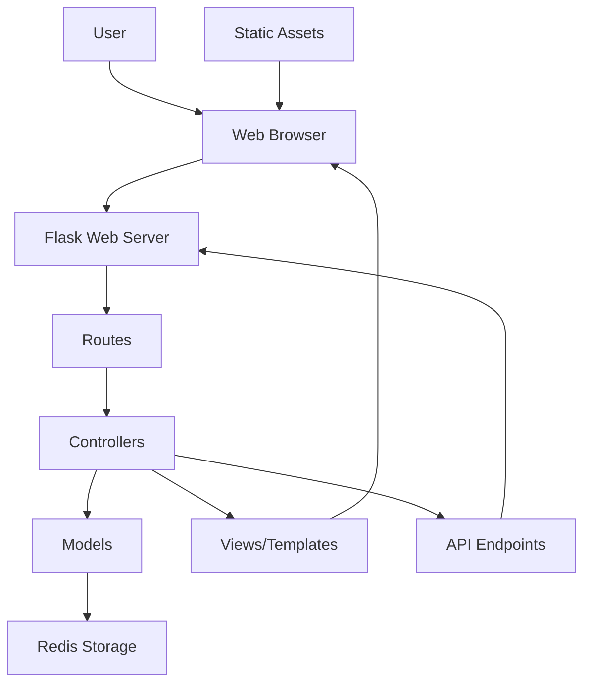

# Dashboard for APT Detection System

This document provides detailed information about the dashboard component of the APT Detection System, including its features, architecture, customization options, and usage.

## Overview

The dashboard provides a comprehensive visualization and analysis interface for the APT Detection System. It allows security analysts to monitor alerts, analyze entity behavior, and investigate potential threats in real-time.

## Features

The dashboard includes the following key features:

### 1. Overview Page

The overview page provides a high-level summary of the system's status and recent alerts.


Key components:
- **Alert Statistics**: Count of alerts by severity (Critical, High, Medium, Low)
- **Alert Timeline**: Timeline of alerts over the past 24 hours
- **Top Entities**: Entities with the most alerts
- **Source Distribution**: Distribution of alerts by source (Kafka, connectors, behavioral analytics)
- **Recent Alerts**: List of the most recent alerts with basic information

### 2. Alerts Page

The alerts page provides detailed information about all alerts in the system.


Key components:
- **Alert Table**: Table of all alerts with filtering and sorting options
- **Alert Details**: Detailed information about selected alerts
- **MITRE ATT&CK Mapping**: Mapping of alerts to MITRE ATT&CK techniques and tactics
- **Feature Analysis**: Analysis of features that contributed to the alert
- **Timeline View**: Timeline view of alerts for the selected entity

### 3. Entity Analysis Page

The entity analysis page provides detailed information about entity behavior and anomalies.


Key components:
- **Entity Selection**: Dropdown to select an entity for analysis
- **Behavior Timeline**: Timeline of entity behavior over time
- **Feature Trends**: Trends of key features over time
- **Anomaly Detection**: Visualization of anomalies in entity behavior
- **Related Alerts**: Alerts related to the selected entity

### 4. Models Page

The models page provides information about the machine learning models used in the system.


Key components:
- **Model Status**: Status of each model (LightGBM, Bi-LSTM, Hybrid)
- **Model Performance**: Performance metrics for each model
- **Feature Importance**: Importance of features for the LightGBM model
- **Training History**: History of model training and performance
- **Baseline Status**: Status of behavioral baselines for entities

### 5. Connectors Page

The connectors page provides information about the data source connectors.


Key components:
- **Connector Status**: Status of each connector (Kafka, Wazuh, Elasticsearch)
- **Data Collection**: Statistics on data collected from each source
- **Connection Settings**: Configuration settings for each connector
- **Error Logs**: Recent error logs from connectors

### 6. Settings Page

The settings page allows users to configure the dashboard and system settings.


Key components:
- **User Preferences**: User-specific settings (theme, timezone, etc.)
- **Alert Settings**: Configuration for alert display and notification
- **System Settings**: General system settings
- **API Configuration**: Configuration for external API connections

## Architecture

The dashboard is built using Flask, a lightweight Python web framework, and follows a Model-View-Controller (MVC) architecture.



### Components

1. **Flask Web Server**: Handles HTTP requests and responses
2. **Routes**: Define URL patterns and map them to controllers
3. **Controllers**: Handle business logic and data processing
4. **Models**: Interact with data storage (Redis)
5. **Views/Templates**: Render HTML pages with data
6. **Static Assets**: CSS, JavaScript, and images
7. **API Endpoints**: Provide data for AJAX requests

### Key Files

- **app.py**: Main Flask application
- **templates/**: HTML templates for each page
- **static/**: Static assets (CSS, JavaScript, images)
- **routes/**: Route definitions
- **controllers/**: Controller logic
- **models/**: Data models

## Data Flow

The dashboard retrieves data from Redis storage, which is populated by the data ingestion and alert generation components of the system.

1. **Data Retrieval**: The dashboard retrieves alerts and other data from Redis
2. **Data Processing**: The data is processed and transformed for visualization
3. **Rendering**: The processed data is rendered in the appropriate templates
4. **User Interaction**: User interactions trigger AJAX requests to update the display
5. **Real-time Updates**: The dashboard uses polling or WebSockets to update data in real-time

## Implementation

The dashboard is implemented using the following technologies:

- **Backend**: Flask (Python)
- **Frontend**: HTML, CSS, JavaScript
- **Data Visualization**: Plotly.js, Chart.js
- **UI Framework**: Bootstrap
- **Data Storage**: Redis
- **Real-time Updates**: AJAX polling or WebSockets

### Flask Application

The main Flask application is defined in `dashboard/app.py`:

```python
from flask import Flask, render_template, jsonify, request, redirect, url_for
import os
import yaml
import logging
from datetime import datetime, timedelta

# Import visualization functions
from visualization import create_entity_behavior_plot, create_alert_timeline_plot, create_severity_distribution_plot, create_source_distribution_plot, create_entity_feature_plot

# Import Redis storage
import redis_storage

# Create Flask app
app = Flask(__name__, 
            template_folder='dashboard/templates',
            static_folder='dashboard/static')

# Load configuration
def load_config():
    config_path = os.path.join(os.path.dirname(__file__), '..', 'config.yaml')
    with open(config_path, 'r') as file:
        return yaml.safe_load(file)

# Routes
@app.route('/')
def index():
    # Get alerts from Redis
    alerts = redis_storage.get_alerts()
    
    # Process alerts for visualization
    # ...
    
    # Render template with data
    return render_template('index.html', 
                          alert_count=len(alerts),
                          critical_count=critical_count,
                          high_count=high_count,
                          medium_count=medium_count,
                          low_count=low_count,
                          alert_timeline=alert_timeline,
                          top_entities=top_entities,
                          source_distribution=source_distribution,
                          recent_alerts=recent_alerts)

# More routes...

# API endpoints
@app.route('/api/alerts')
def api_alerts():
    # Get alerts from Redis
    alerts = redis_storage.get_alerts()
    
    # Filter alerts based on request parameters
    # ...
    
    # Return JSON response
    return jsonify(alerts)

# More API endpoints...

# Run the app
if __name__ == '__main__':
    app.run(debug=True, host='0.0.0.0', port=5000)
```

### Templates

The dashboard uses Jinja2 templates for rendering HTML pages. The templates are stored in the `dashboard/templates/` directory.

Example template (`dashboard/templates/index.html`):

```html


APT Detection System - Dashboard


<div class="container-fluid">
    <div class="row">
        <div class="col-md-3">
            <div class="card">
                <div class="card-header">
                    <h5 class="card-title">Alert Statistics</h5>
                </div>
                <div class="card-body">
                    <div class="alert-stats">
                        <div class="alert-stat critical">
                            <span class="stat-label">Critical</span>
                            <span class="stat-value">{{ critical_count }}</span>
                        </div>
                        <div class="alert-stat high">
                            <span class="stat-label">High</span>
                            <span class="stat-value">{{ high_count }}</span>
                        </div>
                        <div class="alert-stat medium">
                            <span class="stat-label">Medium</span>
                            <span class="stat-value">{{ medium_count }}</span>
                        </div>
                        <div class="alert-stat low">
                            <span class="stat-label">Low</span>
                            <span class="stat-value">{{ low_count }}</span>
                        </div>
                    </div>
                </div>
            </div>
        </div>
        
        <div class="col-md-9">
            <div class="card">
                <div class="card-header">
                    <h5 class="card-title">Alert Timeline</h5>
                </div>
                <div class="card-body">
                    <div id="alert-timeline"></div>
                </div>
            </div>
        </div>
    </div>
    
    <!-- More dashboard components... -->
</div>



<script>
    // JavaScript for interactive components
    document.addEventListener('DOMContentLoaded', function() {
        // Create alert timeline plot
        var alertTimelineData = {{ alert_timeline|safe }};
        createAlertTimelinePlot('alert-timeline', alertTimelineData);
        
        // More JavaScript...
    });
</script>

```

### Static Assets

The dashboard uses static assets for styling and client-side functionality. These assets are stored in the `dashboard/static/` directory.

Example CSS (`dashboard/static/css/style.css`):

```css
/* Dashboard styles */
.alert-stats {
    display: flex;
    justify-content: space-between;
}

.alert-stat {
    text-align: center;
    padding: 10px;
    border-radius: 5px;
    flex: 1;
    margin: 0 5px;
}

.alert-stat.critical {
    background-color: #dc3545;
    color: white;
}

.alert-stat.high {
    background-color: #fd7e14;
    color: white;
}

.alert-stat.medium {
    background-color: #ffc107;
    color: black;
}

.alert-stat.low {
    background-color: #28a745;
    color: white;
}

/* More styles... */
```

Example JavaScript (`dashboard/static/js/dashboard.js`):

```javascript
// Dashboard JavaScript

// Create alert timeline plot
function createAlertTimelinePlot(elementId, data) {
    var layout = {
        title: 'Alert Timeline',
        xaxis: {
            title: 'Time'
        },
        yaxis: {
            title: 'Alert Count'
        }
    };
    
    Plotly.newPlot(elementId, data, layout);
}

// More JavaScript functions...
```

## Customization

The dashboard can be customized in several ways:

### 1. Theme Customization

The dashboard supports theme customization through CSS variables:

```css
:root {
    --primary-color: #007bff;
    --secondary-color: #6c757d;
    --success-color: #28a745;
    --danger-color: #dc3545;
    --warning-color: #ffc107;
    --info-color: #17a2b8;
    --light-color: #f8f9fa;
    --dark-color: #343a40;
    
    --font-family: 'Roboto', sans-serif;
    --font-size-base: 1rem;
    --line-height-base: 1.5;
    
    --border-radius: 0.25rem;
    --box-shadow: 0 0.5rem 1rem rgba(0, 0, 0, 0.15);
}
```

To customize the theme, create a custom CSS file with your preferred values for these variables.

### 2. Layout Customization

The dashboard layout can be customized by modifying the templates:

1. **Component Arrangement**: Rearrange components by modifying the HTML structure
2. **Component Size**: Adjust the size of components by modifying the Bootstrap grid classes
3. **Component Visibility**: Show or hide components based on user preferences

### 3. Data Visualization Customization

The data visualizations can be customized by modifying the visualization functions:

1. **Plot Types**: Change the type of plots used for different visualizations
2. **Color Schemes**: Customize the color schemes used for visualizations
3. **Time Ranges**: Adjust the time ranges for time-based visualizations

### 4. Adding Custom Components

You can add custom components to the dashboard by:

1. Creating a new template for the component
2. Adding the necessary routes and controllers
3. Implementing the required data processing logic
4. Adding the component to the appropriate page template

## Usage

### Running the Dashboard

To run the dashboard:

```bash
python dashboard/app.py
```

This will start the Flask development server, and the dashboard will be accessible at `http://localhost:5000`.

For production deployment, it is recommended to use a production-ready WSGI server like Gunicorn:

```bash
gunicorn -w 4 -b 0.0.0.0:5000 dashboard.app:app
```

### Accessing the Dashboard

The dashboard can be accessed through a web browser at `http://localhost:5000` (or the appropriate host and port for your deployment).

### User Interaction

Users can interact with the dashboard in several ways:

1. **Navigation**: Use the navigation menu to switch between pages
2. **Filtering**: Use filters to narrow down the displayed data
3. **Selection**: Click on elements to view more details
4. **Time Range**: Adjust the time range for time-based visualizations
5. **Export**: Export data and visualizations for reporting

## Security Considerations

The dashboard implements several security measures:

1. **Authentication**: User authentication to control access
2. **Authorization**: Role-based access control for different features
3. **Input Validation**: Validation of all user inputs to prevent injection attacks
4. **CSRF Protection**: Protection against cross-site request forgery
5. **XSS Prevention**: Prevention of cross-site scripting attacks
6. **Secure Cookies**: Secure and HTTP-only cookies for session management

## Performance Optimization

The dashboard includes several performance optimizations:

1. **Data Pagination**: Pagination of large datasets to reduce load times
2. **Lazy Loading**: Lazy loading of components that are not immediately visible
3. **Caching**: Caching of frequently accessed data
4. **Asynchronous Loading**: Asynchronous loading of data to improve responsiveness
5. **Optimized Queries**: Optimized Redis queries to reduce response times

## Troubleshooting

### Common Issues

1. **Dashboard Not Loading**:
   - Check if the Flask server is running
   - Verify that Redis is running and accessible
   - Check for errors in the Flask server logs

2. **No Alerts Displayed**:
   - Verify that alerts are being stored in Redis
   - Check the Redis connection settings
   - Ensure that the data ingestion components are running

3. **Visualizations Not Rendering**:
   - Check for JavaScript errors in the browser console
   - Verify that the required data is available
   - Ensure that the visualization libraries are loaded correctly

4. **Slow Performance**:
   - Check the number of alerts being processed
   - Verify that Redis is properly configured
   - Consider implementing additional caching

### Debugging

To enable debug mode:

```bash
export FLASK_DEBUG=1
python dashboard/app.py
```

This will provide more detailed error messages and enable the Flask debugger.

## Conclusion

The dashboard provides a comprehensive visualization and analysis interface for the APT Detection System. It allows security analysts to monitor alerts, analyze entity behavior, and investigate potential threats in real-time. The dashboard is highly customizable and can be adapted to meet specific security monitoring needs.
