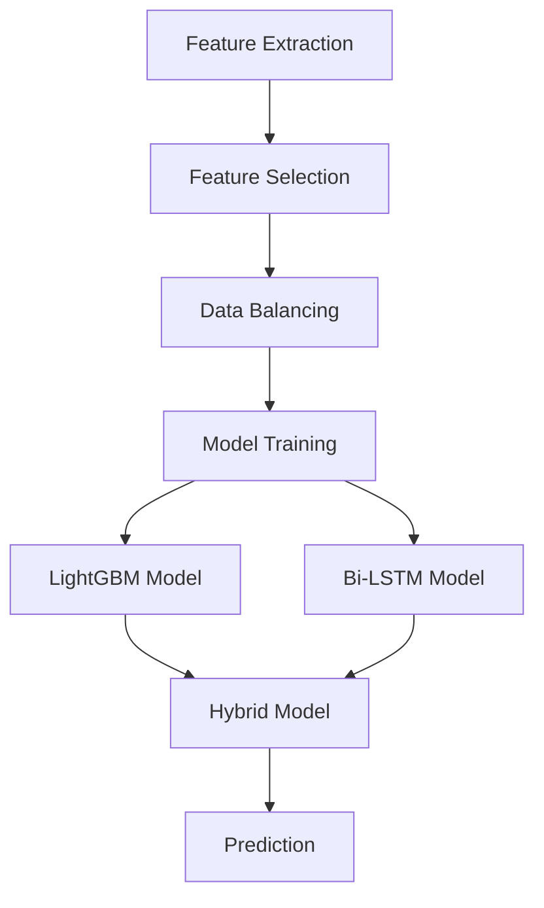

# Machine Learning Models in the APT Detection System

This document provides detailed information about the machine learning models used in the APT Detection System, including the hybrid model approach, feature selection, data balancing, and model training.

## Overview

The APT Detection System uses a hybrid approach that combines multiple machine learning models to detect advanced persistent threats. This approach leverages the strengths of different algorithms to provide more accurate and robust threat detection.

## Model Architecture

The system employs a hybrid model architecture that combines:

1. **LightGBM**: A gradient boosting framework that uses tree-based learning algorithms
2. **Bi-LSTM**: A bidirectional long short-term memory neural network for sequence analysis

These models are combined in a hybrid classifier that leverages the strengths of both approaches.



## Feature Selection

The system uses the HHOSSSA (Hybrid Harmony-Owl Search-Salp Swarm Algorithm) for feature selection, which is a novel approach that combines multiple metaheuristic algorithms.

### HHOSSSA Algorithm

The HHOSSSA algorithm combines:

1. **Harmony Search (HS)**: Inspired by the improvisation process of musicians
2. **Owl Search Algorithm (OSA)**: Based on the hunting behavior of owls
3. **Salp Swarm Algorithm (SSA)**: Inspired by the swarming behavior of salps

This hybrid approach provides several advantages:

- **Exploration**: Better exploration of the feature space
- **Exploitation**: More effective exploitation of promising features
- **Convergence**: Faster convergence to optimal feature subsets
- **Robustness**: More robust to local optima

### Implementation

The HHOSSSA feature selection is implemented in `feature_selection/hhosssa_feature_selection.py`. The key steps are:

1. **Initialization**: Initialize a population of feature subsets
2. **Fitness Evaluation**: Evaluate each subset using a classifier and a fitness function
3. **Hybrid Search**: Apply HS, OSA, and SSA operators to generate new feature subsets
4. **Selection**: Select the best feature subsets for the next iteration
5. **Termination**: Stop when a termination criterion is met (e.g., maximum iterations)

### Usage

```python
from feature_selection.hhosssa_feature_selection import HHOSSSAFeatureSelection

# Create feature selector
feature_selector = HHOSSSAFeatureSelection(
    n_features=10,  # Number of features to select
    population_size=30,  # Population size
    max_iterations=100,  # Maximum iterations
    classifier='lightgbm'  # Classifier to use for evaluation
)

# Fit and transform
X_selected = feature_selector.fit_transform(X, y)
```

## Data Balancing

The system uses HHOSSSA-SMOTE for data balancing, which is a novel approach that combines the HHOSSSA algorithm with Synthetic Minority Over-sampling Technique (SMOTE).

### HHOSSSA-SMOTE Algorithm

The HHOSSSA-SMOTE algorithm:

1. Uses HHOSSSA to select the most informative features
2. Applies SMOTE to generate synthetic samples for the minority class
3. Optimizes the SMOTE parameters using the HHOSSSA algorithm

This approach provides several advantages:

- **Quality**: Higher quality synthetic samples
- **Relevance**: Synthetic samples are generated based on the most informative features
- **Efficiency**: More efficient use of synthetic samples
- **Performance**: Better classification performance on imbalanced datasets

### Implementation

The HHOSSSA-SMOTE data balancing is implemented in `data_balancing/hhosssa_smote.py`. The key steps are:

1. **Feature Selection**: Select the most informative features using HHOSSSA
2. **Parameter Optimization**: Optimize SMOTE parameters using HHOSSSA
3. **Synthetic Sample Generation**: Generate synthetic samples using SMOTE with optimized parameters
4. **Sample Selection**: Select the most informative synthetic samples

### Usage

```python
from data_balancing.hhosssa_smote import HHOSSSASMOTE

# Create data balancer
data_balancer = HHOSSSASMOTE(
    sampling_strategy='auto',  # Sampling strategy
    k_neighbors=5,  # Number of nearest neighbors
    n_features=10,  # Number of features to select
    population_size=30,  # Population size
    max_iterations=100  # Maximum iterations
)

# Fit and resample
X_resampled, y_resampled = data_balancer.fit_resample(X, y)
```

## LightGBM Model

LightGBM is a gradient boosting framework that uses tree-based learning algorithms. It is designed for distributed and efficient training and has the following advantages:

- **Speed**: Faster training speed and lower memory usage
- **Accuracy**: Higher accuracy than other boosting algorithms
- **Efficiency**: Support for parallel, distributed, and GPU learning
- **Handling**: Capable of handling large-scale data

### Implementation

The LightGBM model is implemented in `models/lightgbm_model.py`. The key components are:

1. **Model Definition**: Define the LightGBM model with appropriate parameters
2. **Training**: Train the model on the training data
3. **Prediction**: Make predictions on new data
4. **Evaluation**: Evaluate the model performance

### Configuration

The LightGBM model can be configured in `config.yaml`:

```yaml
model_paths:
  lightgbm: lightgbm_model.pkl

training_params:
  lightgbm:
    num_leaves: 31
    learning_rate: 0.05
    n_estimators: 100
    max_depth: -1
    min_child_samples: 20
    subsample: 0.8
    colsample_bytree: 0.8
    reg_alpha: 0.1
    reg_lambda: 0.1
    random_state: 42
```

### Usage

```python
from models.lightgbm_model import LightGBMModel

# Create model
model = LightGBMModel(
    num_leaves=31,
    learning_rate=0.05,
    n_estimators=100
)

# Train model
model.train(X_train, y_train)

# Make predictions
predictions = model.predict(X_test)

# Save model
model.save('models/lightgbm_model.pkl')

# Load model
model = LightGBMModel.load('models/lightgbm_model.pkl')
```

## Bi-LSTM Model

Bi-LSTM (Bidirectional Long Short-Term Memory) is a type of recurrent neural network that processes data in both forward and backward directions. It is particularly effective for sequence data and has the following advantages:

- **Context**: Captures context from both past and future
- **Memory**: Long-term memory capabilities
- **Sequences**: Effective for sequence data
- **Patterns**: Captures complex temporal patterns

### Implementation

The Bi-LSTM model is implemented in `models/bilstm_model.py`. The key components are:

1. **Model Definition**: Define the Bi-LSTM model with appropriate architecture
2. **Training**: Train the model on the training data
3. **Prediction**: Make predictions on new data
4. **Evaluation**: Evaluate the model performance

### Configuration

The Bi-LSTM model can be configured in `config.yaml`:

```yaml
model_paths:
  bilstm: bilstm_model.h5

training_params:
  bilstm:
    epochs: 5
    batch_size: 32
    lstm_units: 64
    dropout_rate: 0.2
    recurrent_dropout: 0.2
    optimizer: adam
    learning_rate: 0.001
```

### Usage

```python
from models.bilstm_model import BiLSTMModel

# Create model
model = BiLSTMModel(
    input_shape=(sequence_length, n_features),
    lstm_units=64,
    dropout_rate=0.2
)

# Train model
model.train(X_train, y_train, epochs=5, batch_size=32)

# Make predictions
predictions = model.predict(X_test)

# Save model
model.save('models/bilstm_model.h5')

# Load model
model = BiLSTMModel.load('models/bilstm_model.h5')
```

## Hybrid Model

The hybrid model combines the LightGBM and Bi-LSTM models to leverage the strengths of both approaches. It uses a weighted ensemble approach to combine the predictions.

### Advantages

The hybrid approach provides several advantages:

- **Complementary Strengths**: Combines the strengths of tree-based and neural network models
- **Robustness**: More robust to different types of data and attack patterns
- **Accuracy**: Higher accuracy than individual models
- **Adaptability**: Better adaptability to evolving threats

### Implementation

The hybrid model is implemented in `models/hybrid_classifier.py`. The key components are:

1. **Model Combination**: Combine the LightGBM and Bi-LSTM models
2. **Weighted Ensemble**: Use a weighted ensemble approach to combine predictions
3. **Adaptive Weighting**: Adapt weights based on model performance
4. **Confidence Scores**: Generate confidence scores for predictions

### Configuration

The hybrid model can be configured in `config.yaml`:

```yaml
hybrid_model:
  lightgbm_weight: 0.6
  bilstm_weight: 0.4
  threshold: 0.7
  adaptive_weights: true
```

### Usage

```python
from models.hybrid_classifier import HybridClassifier
from models.lightgbm_model import LightGBMModel
from models.bilstm_model import BiLSTMModel

# Load individual models
lightgbm_model = LightGBMModel.load('models/lightgbm_model.pkl')
bilstm_model = BiLSTMModel.load('models/bilstm_model.h5')

# Create hybrid model
hybrid_model = HybridClassifier(
    models=[lightgbm_model, bilstm_model],
    weights=[0.6, 0.4],
    threshold=0.7
)

# Make predictions
predictions, confidence_scores = hybrid_model.predict(X_test)
```

## Model Training

The model training process involves several steps:

1. **Data Preprocessing**: Clean and normalize the data
2. **Feature Selection**: Select the most informative features using HHOSSSA
3. **Data Balancing**: Balance the dataset using HHOSSSA-SMOTE
4. **Model Training**: Train the LightGBM and Bi-LSTM models
5. **Hybrid Model**: Combine the models into a hybrid classifier
6. **Evaluation**: Evaluate the model performance using cross-validation

### Implementation

The model training process is implemented in `models/train_models.py`. The key steps are:

1. **Load Data**: Load the training data
2. **Preprocess Data**: Preprocess the data
3. **Select Features**: Select features using HHOSSSA
4. **Balance Data**: Balance the data using HHOSSSA-SMOTE
5. **Train Models**: Train the LightGBM and Bi-LSTM models
6. **Create Hybrid Model**: Create the hybrid model
7. **Evaluate Models**: Evaluate the models using cross-validation
8. **Save Models**: Save the trained models

### Usage

```bash
python models/train_models.py --data_path data/training_data.csv --save_dir models/saved
```

## Model Evaluation

The model evaluation process involves several metrics:

1. **Accuracy**: Percentage of correct predictions
2. **Precision**: Percentage of true positives among positive predictions
3. **Recall**: Percentage of true positives among actual positives
4. **F1 Score**: Harmonic mean of precision and recall
5. **AUC-ROC**: Area under the Receiver Operating Characteristic curve
6. **Confusion Matrix**: Matrix showing true positives, false positives, true negatives, and false negatives

### Implementation

The model evaluation is implemented in `evaluation/evaluation_metrics.py`. The key metrics are:

1. **Classification Metrics**: Accuracy, precision, recall, F1 score
2. **ROC Curve**: ROC curve and AUC-ROC
3. **Confusion Matrix**: Confusion matrix
4. **Feature Importance**: Feature importance for the LightGBM model
5. **Learning Curves**: Learning curves for the models

### Usage

```python
from evaluation.evaluation_metrics import evaluate_model

# Evaluate model
metrics = evaluate_model(model, X_test, y_test)

# Print metrics
print(f"Accuracy: {metrics['accuracy']:.4f}")
print(f"Precision: {metrics['precision']:.4f}")
print(f"Recall: {metrics['recall']:.4f}")
print(f"F1 Score: {metrics['f1_score']:.4f}")
print(f"AUC-ROC: {metrics['auc_roc']:.4f}")
```

## Cross-Validation

The cross-validation process involves:

1. **K-Fold Cross-Validation**: Split the data into K folds
2. **Stratified Sampling**: Ensure each fold has the same class distribution
3. **Model Training**: Train the model on K-1 folds
4. **Model Evaluation**: Evaluate the model on the remaining fold
5. **Repeat**: Repeat the process K times

### Implementation

The cross-validation is implemented in `evaluation/cross_validation.py`. The key steps are:

1. **Data Splitting**: Split the data into K folds
2. **Model Training**: Train the model on each fold
3. **Model Evaluation**: Evaluate the model on each fold
4. **Metrics Aggregation**: Aggregate the metrics across all folds

### Usage

```python
from evaluation.cross_validation import cross_validate

# Perform cross-validation
cv_results = cross_validate(model, X, y, n_splits=5)

# Print results
print(f"Mean Accuracy: {cv_results['accuracy_mean']:.4f} ± {cv_results['accuracy_std']:.4f}")
print(f"Mean Precision: {cv_results['precision_mean']:.4f} ± {cv_results['precision_std']:.4f}")
print(f"Mean Recall: {cv_results['recall_mean']:.4f} ± {cv_results['recall_std']:.4f}")
print(f"Mean F1 Score: {cv_results['f1_score_mean']:.4f} ± {cv_results['f1_score_std']:.4f}")
print(f"Mean AUC-ROC: {cv_results['auc_roc_mean']:.4f} ± {cv_results['auc_roc_std']:.4f}")
```

## Conclusion

The machine learning models in the APT Detection System provide a robust, accurate approach to detecting advanced persistent threats. By combining multiple models and techniques, the system can effectively identify a wide range of threats and adapt to evolving attack patterns.
