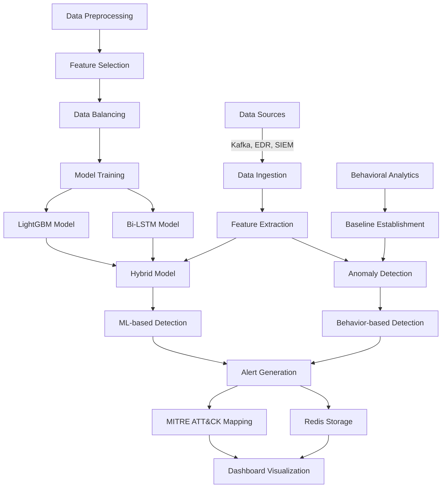

# Advanced Persistent Threat (APT) Detection System

A comprehensive security solution that combines machine learning, behavioral analytics, and real-time monitoring to detect sophisticated cyber threats.


## Overview

The APT Detection System is designed to identify and respond to advanced persistent threats using a multi-layered approach that combines traditional machine learning with behavioral analytics. The system integrates with various data sources, maps detected threats to the MITRE ATT&CK framework, and provides an intuitive dashboard for security analysts.

### Key Capabilities

- **Hybrid Detection Engine**: Combines LightGBM and Bi-LSTM models with behavioral analytics
- **Real-Time Monitoring**: Integrates with EDR, SIEM systems, and Kafka streams
- **Behavioral Analysis**: Establishes baselines and detects anomalies in entity behavior
- **MITRE ATT&CK Mapping**: Automatically maps threats to the MITRE ATT&CK framework
- **Interactive Dashboard**: Provides comprehensive visualization and analysis tools

## Architecture

The system employs a modular architecture with two main workflows:

1. **Model Training Pipeline**: Processes historical data to train detection models
2. **Real-time Detection Pipeline**: Analyzes incoming data streams to identify threats

### System Architecture Diagram



### Architecture Components

- **Data Ingestion**: Collects data from multiple sources (Kafka, EDR, SIEM)
- **Data Preprocessing**: Cleans and normalizes training data
- **Feature Selection**: Uses HHOSSSA algorithm to select relevant features
- **Data Balancing**: Applies HHOSSSA-SMOTE to address class imbalance
- **Model Training**: Trains LightGBM and Bi-LSTM models
- **Hybrid Model**: Combines predictions from multiple models
- **Behavioral Analytics**: Establishes normal behavior baselines
- **Anomaly Detection**: Identifies deviations from normal behavior
- **Alert Generation**: Creates alerts based on detection results
- **Alert Storage**: Stores alerts in Redis for persistence and sharing between processes
- **MITRE ATT&CK Mapping**: Maps threats to the MITRE framework
- **Dashboard**: Visualizes alerts and provides analysis tools

## Installation

### Prerequisites

- Python 3.8 or higher
- Java Development Kit (JDK) 11 or higher (for Kafka integration)
- Wazuh Server (optional, for EDR integration)
- Elasticsearch (optional, for SIEM integration)

### Core Installation

1. Clone the repository:
   ```bash
   git clone https://github.com/yourusername/APT-Detection-System.git
   cd APT-Detection-System
   ```

2. Create and activate a virtual environment:
   ```bash
   python3 -m venv venv
   source venv/bin/activate  # On Windows: venv\Scripts\activate
   ```

3. Install dependencies:
   ```bash
   pip install -r requirements.txt
   ```

### Optional Integrations

#### Kafka Integration

1. Download and install Kafka from the [official Apache website](https://kafka.apache.org/downloads)
   - Select the latest stable release (e.g., 3.5.x)
   - Download the binary distribution (e.g., kafka_2.13-3.5.1.tgz)
   - Extract the archive to your preferred location

   > **Note**: Zookeeper is included in the Kafka distribution. You don't need to download Zookeeper separately.

2. Start Zookeeper and Kafka servers:
   ```bash
   # Navigate to the Kafka directory
   cd kafka_2.13-3.5.1
   
   # Start Zookeeper first
   ./bin/zookeeper-server-start.sh config/zookeeper.properties
   
   # In a new terminal, start Kafka
   ./bin/kafka-server-start.sh config/server.properties
   ```

3. In a new terminal, create a topic for APT detection:
   ```bash
   ./bin/kafka-topics.sh --create --topic apt-topic --bootstrap-server localhost:9092 --partitions 1 --replication-factor 1
   ```

4. Verify the topic was created:
   ```bash
   ./bin/kafka-topics.sh --list --bootstrap-server localhost:9092
   ```

5. Troubleshooting Kafka:
   - If Kafka server quits unexpectedly, check the following:
     - Ensure Zookeeper is running before starting Kafka
     - Increase memory allocation: `export KAFKA_HEAP_OPTS="-Xmx512M -Xms512M"`
     - Check for port conflicts on 9092 (Kafka) and 2181 (Zookeeper)
     - Verify logs in `logs/server.log` for specific error messages
     - Try running in foreground mode for more visible errors: `./bin/kafka-server-start.sh -daemon config/server.properties`

#### Wazuh EDR Integration

1. Install Wazuh Server following the [official documentation](https://documentation.wazuh.com/current/installation-guide/index.html)
2. Configure the Wazuh API in the `config.yaml` file

#### Elasticsearch SIEM Integration

1. Install Elasticsearch following the [official documentation](https://www.elastic.co/guide/en/elasticsearch/reference/current/install-elasticsearch.html)
2. Configure Elasticsearch in the `config.yaml` file

#### Redis Integration (Recommended)

The system uses Redis for robust alert storage, enabling data sharing between different processes and providing persistence across system restarts.

1. Install Redis:
   ```bash
   # On Ubuntu/Debian
   sudo apt-get update
   sudo apt-get install redis-server
   
   # On CentOS/RHEL
   sudo yum install redis
   
   # On macOS with Homebrew
   brew install redis
   ```

2. Start Redis server:
   ```bash
   # On Linux
   sudo systemctl start redis-server
   
   # On macOS
   brew services start redis
   
   # Or run directly
   redis-server
   ```

3. Verify Redis is running:
   ```bash
   redis-cli ping
   ```
   You should receive a response of `PONG`.

4. Test the Redis integration:
   ```bash
   python test_redis.py
   ```

## Configuration

The system is configured through the `config.yaml` file. Key configuration sections include:

### Model Configuration

```yaml
model_paths:
  base_dir: models/
  lightgbm: lightgbm_model.pkl
  bilstm: bilstm_model.h5

training_params:
  lightgbm:
    num_leaves: 31
    learning_rate: 0.05
    n_estimators: 100
  bilstm:
    epochs: 5
    batch_size: 32
    lstm_units: 64
```

### Data Source Configuration

```yaml
data_sources:
  wazuh:
    enabled: false
    api_url: "https://wazuh.example.com:55000"
    username: "wazuh-api-user"
    password: "wazuh-api-password"
    verify_ssl: false
    fetch_interval: 60

  elasticsearch:
    enabled: false
    hosts: ["localhost:9200"]
    index_pattern: "winlogbeat-*"
    username: "elastic"
    password: "changeme"
    verify_certs: false
    fetch_interval: 60
```

### Behavioral Analytics Configuration

```yaml
settings:
  behavioral_analytics:
    baseline_period_days: 7
    anomaly_threshold: 0.8
    time_window_minutes: 10
```

## Usage

### Running the System

The system can be run in different modes depending on your requirements:

#### Complete System

```bash
python main.py --all
```

#### Training Models Only

```bash
python main.py --train
```

#### Running Prediction Engine Only

```bash
python main.py --predict
```

#### Running Dashboard Only

```bash
python main.py --dashboard
```

### Testing with Sample Data

To test the system with sample data, you can use the provided script to produce test messages to Kafka:

```bash
python produce_messages.py
```

## Dashboard

The system includes a comprehensive dashboard for monitoring and analysis, accessible at `http://localhost:5000` when the dashboard is running.

### Dashboard Features

- **Overview**: Alert statistics, timeline, and top entities
- **Alerts**: Detailed alert information with filtering and MITRE ATT&CK mapping
- **Entity Analysis**: Entity behavior statistics and anomaly detection
- **Models**: Status of machine learning models and behavioral baselines
- **Connectors**: Status and configuration of data source connectors

## Project Structure

```
APT_Detection_System/
├── config.yaml                      # Configuration file
├── main.py                          # Main application entry point
├── requirements.txt                 # Project dependencies
├── README.md                        # Documentation
├── REDIS_INTEGRATION.md             # Redis integration documentation
├── redis_storage.py                 # Redis storage module
├── dashboard/                       # Dashboard application
│   ├── app.py                       # Flask application
│   └── templates/                   # HTML templates
├── data_preprocessing/              # Data preprocessing modules
│   ├── data_cleaning.py
│   ├── feature_engineering.py
│   ├── load_dataset.py
│   └── preprocess.py
├── data_balancing/                  # Data balancing modules
│   └── hhosssa_smote.py             # SMOTE implementation
├── evaluation/                      # Model evaluation modules
│   ├── cross_validation.py
│   └── evaluation_metrics.py
├── feature_selection/               # Feature selection modules
│   └── hhosssa_feature_selection.py
├── models/                          # Model definitions and saved models
│   ├── bilstm_model.py
│   ├── hybrid_classifier.py
│   ├── lightgbm_model.py
│   └── train_models.py
├── real_time_detection/             # Real-time detection modules
│   ├── behavioral_analytics.py
│   ├── data_ingestion.py
│   ├── kafka_consumer.py
│   ├── mitre_attack_mapping.py
│   ├── prediction_engine.py
│   ├── redis_integration.py         # Redis storage integration
│   └── connectors/                  # Data source connectors
│       ├── connector_manager.py
│       ├── elasticsearch_connector.py
│       └── wazuh_connector.py
├── visualization.py                 # Visualization utilities
│
│ # Testing and Development Files
├── test_mitre_attack.py             # Tests MITRE ATT&CK mapping
├── test_redis.py                    # Tests Redis integration
├── produce_messages.py              # Generates test Kafka messages
├── sample_alert.json                # Sample alert format
└── synthetic_apt_dataset.csv        # Sample dataset (excluded from Git)
```

### Production vs. Testing Files

The repository is organized to clearly separate production code from testing utilities:

#### Production Files
- Core system modules (`main.py`, `config.yaml`, etc.)
- All modules in the directories (`real_time_detection/`, `models/`, etc.)
- Redis integration (`redis_storage.py`, `real_time_detection/redis_integration.py`)
- Dashboard application (`dashboard/`)

#### Testing/Development Files
- Test scripts (`test_redis.py`, `test_mitre_attack.py`)
- Sample data generation (`produce_messages.py`)
- Sample data files (`sample_alert.json`, `synthetic_apt_dataset.csv`)

Large files like model binaries (*.h5, *.pkl) and the dataset CSV are excluded from the Git repository via .gitignore but can be generated using the provided scripts.

## Technical Details

### Machine Learning Models

The system uses two primary models:

1. **LightGBM**: A gradient boosting framework that uses tree-based learning algorithms
2. **Bi-LSTM**: A bidirectional long short-term memory neural network for sequence analysis

These models are combined into a hybrid classifier that leverages the strengths of both approaches.

### Behavioral Analytics

The behavioral analytics module:

1. Establishes baselines of normal behavior for entities
2. Detects anomalies using the Isolation Forest algorithm
3. Analyzes entity behavior patterns over time
4. Identifies anomalous features contributing to alerts

### MITRE ATT&CK Integration

The system maps detected threats to the MITRE ATT&CK framework, providing:

1. Technique identification
2. Tactic categorization
3. Mitigation recommendations
4. Contextual information for security analysts

## Security Considerations

The APT Detection System is designed with security in mind:

- **Authentication**: Secure authentication for all data source connections
- **Data Encryption**: Encryption of sensitive configuration data
- **Input Validation**: Validation of all input data to prevent injection attacks
- **Secure Defaults**: Secure default configurations for all components

## Contributing

Contributions are welcome! Please follow these steps:

1. Fork the repository
2. Create a feature branch (`git checkout -b feature/amazing-feature`)
3. Commit your changes (`git commit -m 'Add amazing feature'`)
4. Push to the branch (`git push origin feature/amazing-feature`)
5. Open a Pull Request

## License

This project is licensed under the MIT License - see the [LICENSE](LICENSE) file for details.

## Acknowledgments

- MITRE ATT&CK® for the comprehensive threat intelligence framework
- The open-source community for the various libraries and tools used in this project
